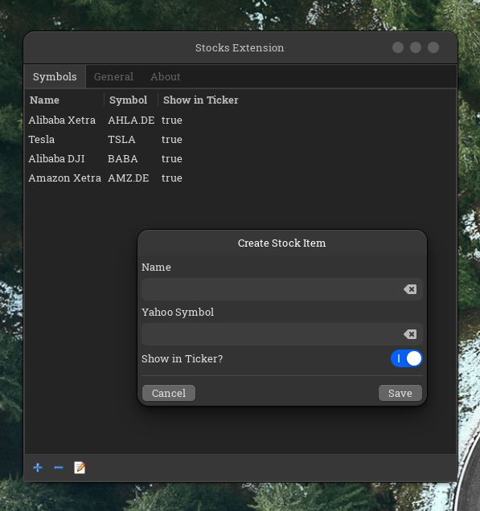

# [stocks-extension](https://extensions.gnome.org/extension/1422/stocks-extension/)
An extension to display stock quotes in the GNOME Shell Panel.


[](https://github.com/qarj/stocks-extension/actions?query=workflow%3A"Build+&+Create+Package")
[](https://github.com/qarj/stocks-extension/actions?query=workflow%3A"Build+Package+&+Create+Release")

A extension to display stock quotes in GNOME Shell Panel

<p align="middle">
    
    
</p>


*stocks-extension* integrates stock quotes to your GNOME Shell Panel =)

Fork of https://github.com/cinatic/stocks-extension

----

## About this fork

Layout re-arranged - instead of using tiny fonts in a vertical layout, it is now displayed
horizontally with much larger fonts.

Duration between stocks increased from 10 seconds to 99 seconds.

Note that currently the first price won't be shown until 99 seconds after start.

## Installation

This fork needs to be installed manually. The official extension can be
installed at https://extensions.gnome.org/extension/1422/stocks-extension/

```
mkdir ~/git
cd ~/git
git clone https://github.com/Qarj/stocks-extension.git
cd stocks-extension
./install.sh
```

Restart GNOME Shell (`Alt`+`F2`, `r`, `Enter`).

Now enable the extension through *gnome-tweak-tool*.

### ArchLinux User Repo (thx [@flortsch](https://github.com/flortsch))
Install the package (https://aur.archlinux.org/packages/gnome-shell-extension-stocks-extension/) e.g. by using yay:

`yay -S gnome-shell-extension-stocks-extension`

## Data Provider

Data is cached for 10 seconds and will reload automatically, click refresh to force a fresh pull immediately. 
Currently, two provider are supported:

 - [Yahoo Finance](https://finance.yahoo.com/)
 - [eastmony](https://www.eastmoney.com/)

## Add Stocks

To add stocks you need a yahoo symbol-exchange pair. Search for stocks on yahoo finance and get your symbol.
To add stocks you need the provider related symbol / identifier. You should be able to get them from yahoo finance or eastmony.com pages.

1. Open Settings
2. Click on the + icon on the bottom of the first tab
3. Enter Symbol (**yahoo** e.g. *AHLA.DE*, **eastmoney** e.g. *1.000001*) and give it a name





### debug
dbus-run-session -- gnome-shell --nested --wayland
