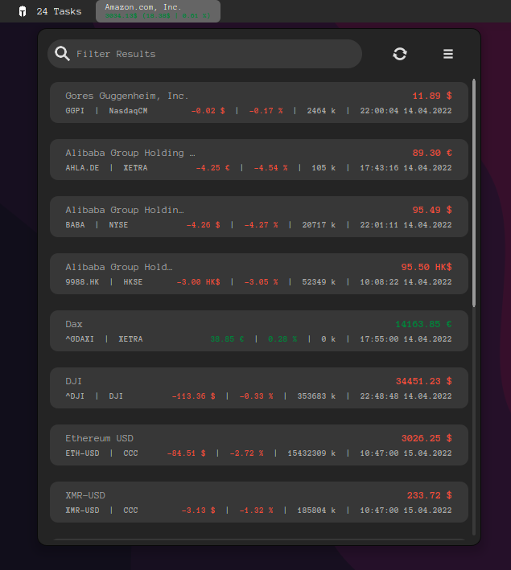

# [stocks-extension](https://extensions.gnome.org/extension/1422/stocks-extension/)

A extension to display stock quotes in GNOME Shell Panel

    

    
    

*stocks-extension* integrates stock quotes to your GNOME Shell Panel =)

----

## Installation

### Over extensions.gnome.org (EGO)

Install via install button -> https://extensions.gnome.org/extension/1422/stocks-extension/

### Generic (Local installation)

Move files into your locale extension directory (~/.local/share/gnome-shell/extensions/stocks@infinicode.de) and enable the extension via the Tweak Tool, it is **important** to move it to **stocks@infinicode.de** otherwise the extension will not be recognized by GNOME.
Restart GNOME Shell (`Alt`+`F2`, `r`, `Enter`) and enable the extension through *gnome-tweak-tool*.

### ArchLinux User Repo (thx [@flortsch](https://github.com/flortsch))
Install the package (https://aur.archlinux.org/packages/gnome-shell-extension-stocks-extension/) e.g. by using yay:

`yay -S gnome-shell-extension-stocks-extension`

## Data Provider

Data is cached for 10 seconds and will reload automatically, click refresh to force a fresh pull immediately. 
Currently, two provider are supported:

 - [Yahoo Finance](https://finance.yahoo.com/)
 - [eastmony](https://www.eastmoney.com/)

## Add Stocks

To add stocks you need the provider related symbol / identifier. You should be able to get them from yahoo finance or eastmony.com pages.

1. Open Settings
2. Add or Select a Portfolio
2. Click on the + icon on the bottom of the first tab
3. Enter Symbol (**yahoo** e.g. *AHLA.DE*, **eastmoney** e.g. *1.000001*) and give it a name

### debug
dbus-run-session -- gnome-shell --nested --wayland
